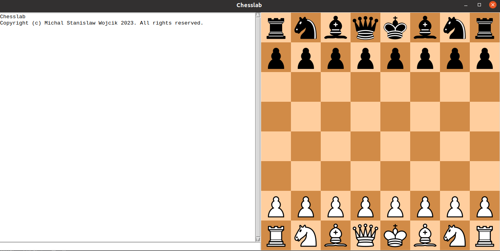

# Chesslab

### Instalation

1. You should have <i>Python</i> with <i>tkinter</i> module. 
There is a big chance you already have it. If not you need to usually install
this package. E.g. in Ubuntu you can run `sudo apt-get install python3-tk`   
2. Clone this repository by

    ```git clone https://github.com/warpdynamicsltd/chesslab.git```
3. Go into `chesslab` directory (e.g. `cd chesslab`)
4. Install required dependencies by

    ```pip -r requrements.txt```
    If you only want to run `chesslab` ui script, minimal requirements are:

    ```pip install chess cairosvg```
5. Install `chesslab` by e.g.:

    ```pip install .```

    If you want to install it for development, use:

    ```pip install -e .```
6. Now, just type `chesslab` in your terminal and gui should start. You should see something like this:

   